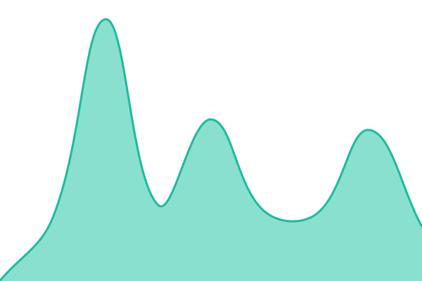

# [📈 Live Status](https://status.polydesk.app): <!--live status--> **🟧 Partial outage**

This repository contains the open-source uptime monitor and status page for [Riccardo Calligaro](riccard0.dev), powered by [Upptime](https://github.com/upptime/upptime).

With [Upptime](https://upptime.js.org), you can get your own unlimited and free uptime monitor and status page, powered entirely by a GitHub repository. We use [Issues](https://github.com/riccardocalligaro/polydesk-upptime/issues) as incident reports, [Actions](https://github.com/riccardocalligaro/polydesk-upptime/actions) as uptime monitors, and [Pages](https://status.polydesk.app) for the status page.

<!--start: status pages-->
<!-- This summary is generated by Upptime (https://github.com/upptime/upptime) -->
<!-- Do not edit this manually, your changes will be overwritten -->
<!-- prettier-ignore -->
| URL | Status | History | Response Time | Uptime |
| --- | ------ | ------- | ------------- | ------ |
|  [Demo](https://demo.polydesk.app/) | 🟩 Up | [demo.yml](https://github.com/riccardocalligaro/polydesk-upptime/commits/HEAD/history/demo.yml) | 

 695ms
     
 | 

<a href="https://status.polydesk.app/history/demo">100.00%</a>
    

|  [Demo API](https://demo.polydesk.app/api/v1/) | 🟩 Up | [demo-api.yml](https://github.com/riccardocalligaro/polydesk-upptime/commits/HEAD/history/demo-api.yml) | 

 453ms
     
 | 

<a href="https://status.polydesk.app/history/demo-api">100.00%</a>
    

|  [San Gaetano](https://sangaetano.polydesk.app/) | 🟥 Down | [san-gaetano.yml](https://github.com/riccardocalligaro/polydesk-upptime/commits/HEAD/history/san-gaetano.yml) | 

 558ms
     
 | 

<a href="https://status.polydesk.app/history/san-gaetano">0.00%</a>
    

|  [San Gaetano API](https://sangaetano.polydesk.app/api/v1/) | 🟩 Up | [san-gaetano-api.yml](https://github.com/riccardocalligaro/polydesk-upptime/commits/HEAD/history/san-gaetano-api.yml) | 

 487ms
     
 | 

<a href="https://status.polydesk.app/history/san-gaetano-api">100.00%</a>
    

|  [BieloHUB](https://bielohub.polydesk.app/) | 🟥 Down | [bielo-hub.yml](https://github.com/riccardocalligaro/polydesk-upptime/commits/HEAD/history/bielo-hub.yml) | 

 562ms
     
 | 

<a href="https://status.polydesk.app/history/bielo-hub">0.00%</a>
    

|  [BieloHUB API](https://bielohub.polydesk.app/api/v1/) | 🟩 Up | [bielo-hub-api.yml](https://github.com/riccardocalligaro/polydesk-upptime/commits/HEAD/history/bielo-hub-api.yml) | 

 560ms
     
 | 

<a href="https://status.polydesk.app/history/bielo-hub-api">100.00%</a>
    

|  [Butterfly](https://butterfly.polydesk.app/) | 🟥 Down | [butterfly.yml](https://github.com/riccardocalligaro/polydesk-upptime/commits/HEAD/history/butterfly.yml) | 

 630ms
     
 | 

<a href="https://status.polydesk.app/history/butterfly">0.00%</a>
    

|  [Butterfly API](https://butterfly.polydesk.app/api/v1/) | 🟥 Down | [butterfly-api.yml](https://github.com/riccardocalligaro/polydesk-upptime/commits/HEAD/history/butterfly-api.yml) | 

 297ms
     
 | 

<a href="https://status.polydesk.app/history/butterfly-api">0.00%</a>
    

|  [Gruppo Paim](https://gruppopaim.polydesk.app/) | 🟥 Down | [gruppo-paim.yml](https://github.com/riccardocalligaro/polydesk-upptime/commits/HEAD/history/gruppo-paim.yml) | 

 478ms
     
 | 

<a href="https://status.polydesk.app/history/gruppo-paim">0.00%</a>
    

|  [Gruppo Paim API](https://gruppopaim.polydesk.app/api/v1/) | 🟩 Up | [gruppo-paim-api.yml](https://github.com/riccardocalligaro/polydesk-upptime/commits/HEAD/history/gruppo-paim-api.yml) | 

 489ms
     
 | 

<a href="https://status.polydesk.app/history/gruppo-paim-api">100.00%</a>
    

|  [Euromedica](https://euromedica.polydesk.app/) | 🟥 Down | [euromedica.yml](https://github.com/riccardocalligaro/polydesk-upptime/commits/HEAD/history/euromedica.yml) | 

 551ms
     
 | 

<a href="https://status.polydesk.app/history/euromedica">0.00%</a>
    

|  [Euromedica API](https://euromedica.polydesk.app/api/v1/) | 🟩 Up | [euromedica-api.yml](https://github.com/riccardocalligaro/polydesk-upptime/commits/HEAD/history/euromedica-api.yml) | 

 487ms
     
 | 

<a href="https://status.polydesk.app/history/euromedica-api">100.00%</a>
    

|  [Sito dimostrativo](https://polydesk.app/) | 🟥 Down | [sito-dimostrativo.yml](https://github.com/riccardocalligaro/polydesk-upptime/commits/HEAD/history/sito-dimostrativo.yml) | 

 98ms
     
 | 

<a href="https://status.polydesk.app/history/sito-dimostrativo">0.00%</a>
    

<!--end: status pages-->

[**Visit our status website →**](https://status.polydesk.app)

## 📄 License

- Powered by: [Upptime](https://github.com/upptime/upptime)
- Code: [MIT](./LICENSE) © [Anand Chowdhary](https://anandchowdhary.com), supported by [Pabio](https://pabio.com)
- Data in the `./history` directory: [Open Database License](https://opendatacommons.org/licenses/odbl/1-0/)
